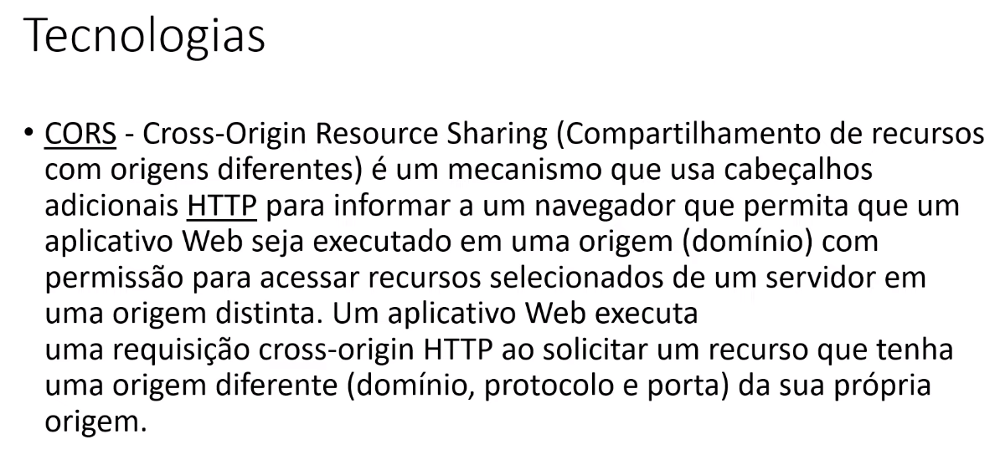

# BACK-END - Sistema Financeiro

Back-End desenvolvido em C#. NET 7. E todos os pacotes instalados durante o curso são e versão 7.0.3.

O Projeto foi desenvolvido com referencias nos seguintes livros:

# Arquitetura Limpa
    O Guia do Artesão para Estrutura e Design de Software

# Domain-Driven Design
    Atacando as Complexidades no Coração do Software

# Código Limpo
    Habilidades Práticas do Agile Software

# Linguagem utilizada na arquitetura
- Nome pastas - Português
- Nome Projeto - Inglês
- Genéricos - Inglês
- Nome de métodos customizados - Português

# Tecnologias
- Identity ( Gerenciamento de usuários)
- Linq c# para as Querys
- Generics
- JWT ( Json Web Token ) / Apis Autenticadas
- Dependency Injection ( ` Singleton` )

# Linguagens - Back-End
- C#/CSHARP
- SQL

# Banco de Dados
- SQL Server

<h1 align="center">💻 Desenvolvido Por: Gilberto Júnior</h1>